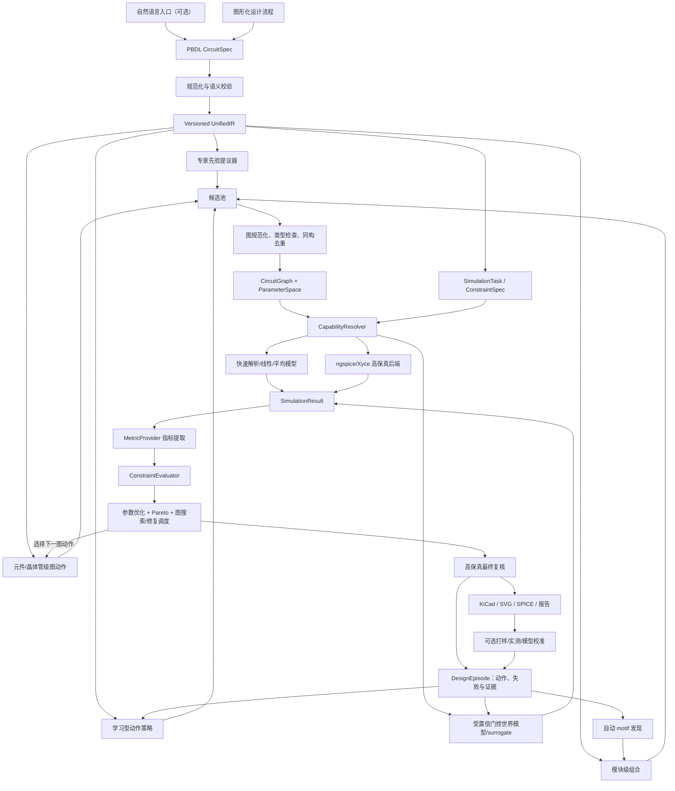

# 通用电路自动设计系统重构实施计划

> 文档版本：1.0  
> 适用仓库：`E:/Pioneer/ai电路`  
> 状态：阶段 0 部分完成（2/7）、阶段 1–4 已完成、阶段 5 进行中、阶段 6–10 未开始；本文将复选框作为进度事实来源，计划与实现的偏差登记在 `docs/plan_deltas.md`  
> 核心目标：在保留专家知识的同时，将系统从“按拓扑族调用专用流程”迁移为“统一电路图 + 多后端仿真 + 通用约束评价 + 可学习候选搜索”。

---

## 0. 文档使用方法

- 本文是总计划和架构约束，不替代每个阶段的具体设计文档与 ADR。
- 每个阶段开始前，将对应任务拆成可独立审查的变更集，并为接口补充类型定义和测试计划。
- 只有满足阶段“退出标准”后才能把下一阶段标为主线工作；探索性分支可以并行，但不得绕过退出标准合入主流程。
- 文中的阶段只表示结构依赖和迁移门槛，不表示排期。
- 实施过程中直接更新本文复选框，并记录关联变更与架构决策。
- 若实现需要违反第 3 章架构原则，必须先新增 ADR 说明原因、替代方案和回退方式。

---

## 1. 执行摘要

### 1.1 最终愿景

系统接受用户对端口、行为、元件库和工程约束的描述，在给定器件模型、物理分析能力、制造工艺和计算预算内，从模块级、元件级乃至晶体管级动作提出多个合法电路图，完成参数求解、分层物理仿真、多目标评价和约束验证，最终输出可解释、可追溯、可由 KiCad 编辑的原理图。

本计划所称“开放式生成”不是宣称任何需求都存在解，也不是让语言模型一次性输出未经验证的网表，而是要求：

1. 候选空间不由专家预先列出的完整拓扑集合封闭定义。
2. 在隐藏完整拓扑或模块组合的 benchmark 上，系统仍能从允许的基础模型和通用图动作构造新图。
3. 生成策略能够依据仿真失败、约束裕量和不确定性反复修改候选，而非只做一次模板选择。
4. 最终正确性由受信物理后端、工程约束和必要时的实测证据决定。
5. 每新增一种物理模型、分析或工艺能力，开放生成边界可扩展，而不需要在主流程中增加拓扑族分派。

目标主链路为：

```text
自然语言（可选入口）
    ↓
PBDL（唯一公开需求规范）
    ↓
UnifiedIR（统一执行中间表示）
    ↓
候选图生成（专家先验 + 模块/元件级图动作 + 有界搜索 + 学习提议）
    ↓
CircuitGraph（唯一候选结构表示）
    ↓
能力解析 + 可学习世界模型 + 多保真物理仿真
    ↓
指标提取 + 声明式约束评价 + Pareto 排序
    ↓
高保真复核 + 必要时实测校准
    ↓
通用 KiCad/SVG/SPICE 输出 + 证据报告 + replay
```

必须停止继续扩张的旧模式为：

```text
识别 Boost/Flyback/某个模板
    ↓
调用该拓扑专用优化器
    ↓
调用该拓扑专用公式
    ↓
调用该拓扑专用验证器和渲染器
```

### 1.2 核心判断

1. 专家系统不是需要删除的遗留物，而应成为候选先验、合法性规则和搜索剪枝器。
2. 注册机制只能解除工程耦合，不能单独提高拓扑表达能力。
3. 真正的通用性来自统一图模型、元件模型库、统一仿真契约和声明式约束。
4. 学习模型首先服务于候选排序和仿真加速，最终正确性必须由受信物理后端确认。
5. 新增“由现有元件模型构成的拓扑”应能只增加数据定义；新增“新物理器件或新分析类型”仍需编写模型或后端代码。
6. 不采用一次性重写。每个阶段都用适配器包裹现有能力，并保持现有 AC/DC 案例持续可运行。
7. 物理不变量和安全规则是硬边界；完整拓扑、模块顺序、常用参数范围和设计经验只能作为可关闭、可度量的搜索先验。
8. 学习目标不只包括候选排序，还包括电路表征、响应/失败预测、下一图动作、候选修复和自动 motif 发现。
9. 推理不是“一次生成网表”，而是“提出候选 → 物理执行 → 读取证据 → 修改图 → 高保真复核”的验证器引导搜索。
10. 长期数据壁垒来自带规格、构造轨迹、失败原因、跨保真差异和实测偏差的 DesignEpisode，而不只是成功网表集合。

### 1.3 本计划不承诺的事项

- 不承诺对任意端口行为都存在可实现电路。
- 不承诺无边界全局最优，只提供声明搜索空间、预算和模型后的有界最优证据。
- 不把“任意电路”解释为脱离器件模型、工艺、频率/功率范围和验证策略的无限生成；每次运行必须声明能力边界。
- 不以神经网络替代物理定律或最终验证。
- 不在早期自行重写完整工业 SPICE 内核。
- 不在最小图、仿真和评价契约形成前把复杂 GNN/Transformer 接入主流程；离线表征、排序和动作模型实验可以提前并行。
- 不在原理图阶段承诺自动完成可生产 PCB 布局布线。

---

## 2. 当前系统基线

### 2.1 已有可复用资产

| 能力 | 当前实现 | 可作为迁移支点 |
|---|---|---|
| 需求入口 | `端口描述语言/`、`circuit_ai/pbdl_boundary.py` | PBDL 已是唯一公开边界 |
| 执行 IR | `circuit_ai/ir.py` | 已保存端口、分析、目标、约束和基础元件 |
| AC 合成 | `templates.py`、`graph_templates.py`、`synthesis.py` | 已有模板、图枚举、参数优化和评分流程 |
| 线性仿真 | `mna.py`、`analysis.py` | 已有 R/C/L、独立源、VCVS 的频域 MNA |
| 可微仿真 | `differentiable.py` | 已有 PyTorch 线性 MNA 与 autograd 路径 |
| DC 电源合成 | `pipeline.py`、`power.py` | Buck/Boost/SEPIC/Flyback 已形成闭环案例 |
| 拓扑知识 | `knowledge.py`、`knowledge/power_topologies.yaml` | 已开始将连接结构从 Python 迁到数据文件 |
| 仿真任务 | `simulation_tasks.py` | 已能从 PBDL 产生部分求解器无关的指标契约 |
| 外部验证 | `spice.py` | 已有 ngspice 可用性检查、运行与 AC 结果解析 |
| 真实元件入口 | `kicad_library.py` | 已能索引本机 KiCad 符号、封装和模型 |
| 原理图输出 | `schematic.py`、`kicad.py`、`power_kicad.py` | 已能输出 SVG 和 KiCad 原理图 |
| 搜索与学习 | `replay.py`、`ranking.py`、`surrogate.py` | 已有 replay、排序器和带置信门控的 surrogate |
| 可视界面 | `webapp.py`、`web/` | 已能填写 PBDL、运行合成和查看电源结果 |

### 2.2 当前最重要的结构债务

1. **两条执行链并行**：AC 使用 `CircuitTemplate → LinearCircuit → MNA`，DC 电源使用 `TopologyCandidate → 专用 Optimizer/Solver`。
2. **按拓扑族硬编码执行**：`pipeline.py::_optimizer_for()` 直接映射四类电源优化器。
3. **专用物理公式**：`power.py` 内各族求解公式与参数类绑定。
4. **专用验证命名和类型**：`validate_boost()` 实际承担所有电源族验证，输入类型仍为 `BoostOperatingPoint`。
5. **专用输出分支**：`power_kicad.py` 和 `power_svg.py` 依赖电源族知识布置元件。
6. **候选图信息不足**：`TopologyCandidate` 只有元件、节点和 metadata，没有正式参数变量、模型引用、单位、额定值、端口契约和图版本。
7. **SimulationTask 仍偏 DC 指标映射**：分析请求、求解结果、波形和失败原因尚未形成完整统一契约。
8. **真实 SPICE 仍是事后 AC 验证器**：还不是可参与优化与多分析的通用后端。
9. **知识库描述完整拓扑多于组合规则**：能够数据化接线，但尚不能系统组合子模块产生新图。
10. **学习链路与电源 replay 尚未统一**：不同任务的数据结构、置信证据和分组键仍需收敛。

### 2.3 当前必须保留的行为基线

重构期间以下功能不得回退：

- PBDL 继续作为唯一用户规范入口。
- 现有 RC/RLC/有源滤波器 AC 合成继续通过。
- 当前 Buck、Boost、SEPIC、隔离 Flyback 案例继续通过。
- 元件库限制、必需元件和最大元件数继续真实约束候选。
- 每次运行继续输出候选、参数、验证、搜索证书、replay、SVG 和 KiCad。
- surrogate 不得绕过真实仿真最终复核。
- 无法执行的分析必须明确报告 unsupported，不得伪造结果。

---

## 3. 架构原则与不可破坏约束

### 3.1 单一事实来源

| 信息 | 唯一事实来源 |
|---|---|
| 用户需求 | PBDL `CircuitSpec` |
| 执行需求 | 版本化 `UnifiedIR` |
| 候选结构 | `CircuitGraph` |
| 元件物理 | `ComponentModel`/SPICE 模型 |
| 仿真条件 | `SimulationRequest` |
| 仿真证据 | `SimulationResult` |
| 指标定义 | `MetricSpec` + `MetricProvider` |
| 通过与否 | `ConstraintEvaluation` |
| 搜索来源 | `CandidateProvenance` |
| 最终原理图 | 已验证 `CircuitGraph` + 参数实例 |

### 3.2 专家、物理和约束三类知识必须分离

```text
专家知识：什么值得生成，什么通常合法，怎样剪枝
物理模型：给定图和参数后，电路如何响应
约束系统：响应是否满足用户需求，候选之间如何比较
```

任何学习模型都不能通过输出一个高分标签替代后两类知识。

### 3.3 候选中不直接复制物理方程

`CircuitGraph` 保存 `model_id`，具体方程、MNA stamp、Jacobian、噪声模型和导出规则属于模型库。这样可避免每个候选携带重复方程并产生版本不一致。

### 3.4 能力分派不以拓扑族为唯一键

执行后端的选择依据为：

```text
候选使用的模型集合
+ 请求的分析类型集合
+ 所需保真度
+ 后端可用性
+ 用户指定策略
```

`family` 只保留用于解释、专家先验、布局提示和统计，不作为唯一执行身份。

### 3.5 无证据不宣称

- surrogate 预测不能标记为 verified。
- 解析平均模型通过不能代表开关瞬态通过。
- ideal 模型通过不能代表真实器件应力和热约束通过。
- ngspice 不可用时必须返回 unavailable，而不是 skipped-as-passed。
- 每个最终结论必须能追溯到后端、模型版本、条件、参数和原始结果摘要。

### 3.6 硬物理边界与软专家先验

知识进入系统前必须分级，避免专家经验无意中封闭生成空间：

| 级别 | 示例 | 对生成器的作用 |
|---|---|---|
| 硬物理不变量 | 引脚角色、KCL/KVL、参考域、隔离、安全连接、模型适用条件 | 生成动作必须满足，不允许学习模型绕过 |
| 任务工程约束 | 额定值、温升、成本、面积、EMI、PVT 裕量 | 由需求和 verification policy 决定是否为硬约束 |
| 专家搜索先验 | 常用拓扑、模块顺序、经验参数范围、布局习惯 | 只影响候选概率、排序和预算，可关闭并做消融 |

禁止把完整拓扑白名单、family 分类器或专家评分伪装成物理合法性。开放生成 benchmark 必须至少包含一次关闭完整拓扑先验的运行，以证明生成能力不等同于模板检索。

---

## 4. 目标总体架构



### 4.1 运行时分层

```text
Specification Layer  PBDL、单位、端口语义、分析和目标
Planning Layer       多分析规划、任务拆分、能力缺口报告
Generation Layer     专家先验、模块组合、元件/晶体管级动作、学习策略
Graph Layer          部分图/完整 CircuitGraph、模型绑定、参数空间、规范化
Execution Layer      仿真后端、世界模型、优化器、保真度调度
Evaluation Layer     指标、约束、Pareto、鲁棒性
Evidence Layer       DesignEpisode、provenance、失败证据、证书、基准报告
Learning Layer       电路表征、世界模型、动作策略、价值模型、motif 发现
Presentation Layer   Web、KiCad、SVG、波形与候选比较
```

---

## 5. 核心数据契约

所有契约必须：

- 使用显式 schema 版本。
- 可稳定序列化为 JSON。
- 字段有单位和方向定义。
- 禁止通过任意 metadata 承担核心语义。
- 对未知字段采用明确的兼容策略。
- 为破坏性变更提供迁移器。

### 5.1 参数变量

```python
@dataclass(frozen=True)
class ParameterVariable:
    id: str
    owner_component: str
    name: str
    quantity: str
    unit: str
    domain: Literal["continuous", "integer", "categorical", "derived"]
    lower: float | None
    upper: float | None
    choices: tuple[str, ...] = ()
    scale: Literal["linear", "log"] = "linear"
    nominal: float | str | None = None
```

要求：

- 电阻、电容、电感默认使用 log 搜索尺度。
- 占空比、效率等无量纲变量必须显式标记。
- 匝比、并联支路数等可使用 integer/continuous，不能靠变量名猜测。
- 派生负载不得伪装成用户可优化元件。

### 5.2 元件模型引用

```python
@dataclass(frozen=True)
class ModelRef:
    model_id: str
    model_version: str
    source: Literal["builtin", "spice", "vendor", "user"]
    source_uri: str | None = None
    checksum: str | None = None
```

模型能力至少声明：

- 引脚名和电气角色。
- 支持的分析类型。
- 参数 schema 与默认值。
- MNA stamp/Jacobian 或外部 SPICE 卡片生成方法。
- 额定电压、电流、功率、温度等可选 rating。
- 许可证和来源信息。

### 5.3 通用元件实例

```python
@dataclass(frozen=True)
class ComponentInstance:
    ref: str
    model: ModelRef
    pins: dict[str, str]              # model pin -> net id
    parameters: dict[str, float | str]
    variables: tuple[ParameterVariable, ...]
    ratings: dict[str, Quantity]
    role: str | None = None
    placement_hint: dict[str, object] = field(default_factory=dict)
```

示例二极管实例可逐步支持：

```text
Vf、Ron、Is、N、Cj、trr、maximum_voltage、maximum_current、package
```

并非所有后端都必须使用所有参数，但后端必须声明哪些参数被忽略，禁止静默丢弃。

### 5.4 CircuitGraph

```python
@dataclass(frozen=True)
class CircuitGraph:
    schema_version: int
    graph_id: str
    ports: tuple[GraphPort, ...]
    nets: tuple[Net, ...]
    components: tuple[ComponentInstance, ...]
    variables: tuple[ParameterVariable, ...]
    relations: tuple[GraphRelation, ...]
    layout_hints: tuple[LayoutHint, ...]
    provenance: CandidateProvenance
```

必须满足的图不变量：

1. 元件引用唯一。
2. net id 唯一且所有引脚引用均存在。
3. 每个模型引脚恰好绑定一次，除非模型声明可选引脚。
4. 端口终端映射到有效 net。
5. 隔离域之间不存在未授权导电路径。
6. 参数 id 唯一，单位和上下界有效。
7. 不允许自连接的二端元件。
8. 不允许未声明的悬空端口和无意义支路。
9. 规范化后具有稳定 graph hash。
10. 图 hash 不依赖内部节点临时命名和元件枚举顺序。

### 5.5 候选来源证据

```python
@dataclass(frozen=True)
class CandidateProvenance:
    proposer_id: str
    proposer_version: str
    method: Literal["expert", "grammar", "enumeration", "learned", "replay"]
    parent_graph_ids: tuple[str, ...]
    construction_actions: tuple[dict, ...]
    knowledge_sources: tuple[dict, ...]
    random_seed: int | None
```

### 5.6 统一仿真请求

```python
@dataclass(frozen=True)
class SimulationRequest:
    request_id: str
    analysis: AnalysisSpec
    graph_id: str
    parameter_values: dict[str, float | str]
    excitations: tuple[Excitation, ...]
    conditions: OperatingConditions
    requested_observables: tuple[ObservableSpec, ...]
    fidelity: Literal["surrogate", "analytic", "reduced", "spice"]
```

分析类型逐步支持：

```text
dc_operating_point
dc_transfer
small_signal_ac
transient
periodic_steady_state
noise
stability
thermal
monte_carlo
```

### 5.7 统一仿真结果

```python
@dataclass(frozen=True)
class SimulationResult:
    request_id: str
    backend_id: str
    backend_version: str
    model_manifest: tuple[ModelRef, ...]
    status: Literal["passed", "failed", "unsupported", "unavailable", "timeout"]
    scalars: dict[str, Quantity]
    waveforms: dict[str, Waveform]
    diagnostics: tuple[Diagnostic, ...]
    runtime_s: float
    fidelity: str
    evidence_hash: str
```

`status` 必须区分：

- `failed`：后端执行了但数值失败或不收敛。
- `unsupported`：后端不支持模型或分析。
- `unavailable`：外部工具未安装或资源不可用。
- `timeout`：预算耗尽。
- 以上状态均不得当成约束通过。

### 5.8 指标与约束

```python
@dataclass(frozen=True)
class MetricSpec:
    id: str
    metric_kind: str
    source_request_id: str
    subject: str
    unit: str
    reduction: dict[str, object]

@dataclass(frozen=True)
class ConstraintSpec:
    id: str
    metric_id: str
    operator: Literal["equal", "minimum", "maximum", "interval"]
    value: Quantity | None
    minimum: Quantity | None
    maximum: Quantity | None
    tolerance: ToleranceSpec | None
    severity: Literal["hard", "soft", "objective"]
    weight: float | None
```

约束评价必须使用单位转换后的标准量，不能直接比较裸浮点数。

### 5.9 部分图与通用图动作

开放生成不能只记录最终 `CircuitGraph`。搜索状态必须能够表示尚未完成但仍可能合法完成的部分图，并通过统一动作词汇演化：

```python
@dataclass(frozen=True)
class GraphAction:
    action_id: str
    action_kind: Literal[
        "add_module", "add_component", "connect", "disconnect",
        "create_net", "merge_net", "bind_port", "set_model",
        "expose_variable", "terminate_port", "replace_subgraph",
        "finish_graph",
    ]
    operands: dict[str, object]
    proposer_id: str
    proposer_version: str
    parent_state_hash: str

@dataclass(frozen=True)
class PartialCircuitState:
    schema_version: int
    state_hash: str
    graph: CircuitGraph
    open_requirements: tuple[OpenRequirement, ...]
    legal_action_mask: tuple[str, ...]
    depth: int
```

要求：

- 规则搜索、进化搜索和学习模型共享同一动作执行器，不能各自实现不同的接线语义。
- 动作合法性由模型引脚、参考域、隔离域和硬物理不变量决定；专家偏好只能调整优先级。
- `legal_action_mask` 是执行器根据当前状态计算的结果，学习模型不能自行绕过。
- 每个动作前后都产生稳定 state hash；未完成图不得误标为可仿真的完整图。
- 必须支持从元件级动作构造候选，不能要求每条路径都从预定义 `GraphFragment` 开始。

### 5.10 DesignEpisode 与动作结果

训练和复现的基本单位不是单条成功网表，而是一次完整设计经历：

```python
@dataclass(frozen=True)
class DesignStep:
    step_index: int
    state_before_hash: str
    action: GraphAction
    state_after_hash: str | None
    structural_status: str
    simulation_request_ids: tuple[str, ...]
    simulation_result_ids: tuple[str, ...]
    constraint_evaluation_ids: tuple[str, ...]
    failure_category: str | None
    cost: dict[str, float]

@dataclass(frozen=True)
class DesignEpisode:
    episode_id: str
    spec_hash: str
    environment_manifest_hash: str
    initial_state_hash: str
    steps: tuple[DesignStep, ...]
    final_graph_ids: tuple[str, ...]
    termination_reason: str
    budget: dict[str, float]
    random_seed: int | None
```

`DesignEpisode` 必须保存成功、失败、回退、超时和不支持路径，使模型能够学习“某种修改导致了什么物理后果”，而不只是拟合最终 accepted 标签。实测结果进入同一 episode 的扩展证据，但必须与仿真结果区分来源和时间。

---

## 6. 能力注册与解析机制

### 6.1 不采用三个彼此独立的注册表

不单独维护可能互相失配的 `SolverRegistry`、`RendererRegistry` 和 `ConstraintRegistry`。采用一个统一的 `CapabilityRegistry` 保存可组合能力声明，具体实现仍可按协议拆分。

```python
@dataclass(frozen=True)
class CapabilityRegistration:
    capability_id: str
    version: str
    supported_models: frozenset[str]
    supported_analyses: frozenset[str]
    simulator_factory: Callable[..., SimulatorBackend]
    optimizer_factory: Callable[..., Optimizer] | None
    metric_provider_ids: tuple[str, ...]
    exporter_ids: tuple[str, ...]
    fidelity: str
    priority: int
```

### 6.2 解析算法

对每个候选和任务：

1. 收集图中所有 `model_id`。
2. 收集任务需要的分析类型和观测量。
3. 过滤不能完整覆盖模型与分析的注册能力。
4. 检查外部依赖可用性。
5. 按用户策略、保真度、成本和优先级排序。
6. 生成可执行计划，而不是立即调用某个 family 函数。
7. 若无后端可执行，返回结构化 capability gap。

### 6.3 注册边界

- 使用现有模型组成的新拓扑：只需知识/语法数据，不改主流程。
- 使用已有分析的新数值后端：注册后端实现，不改主流程。
- 新指标：注册 MetricProvider，不改主流程。
- 新导出格式：注册 Exporter，不改主流程。
- 新物理器件：必须增加 ComponentModel，这是合理代码扩展。
- 新分析数学：必须增加 SimulatorBackend，这是合理代码扩展。

### 6.4 第一批适配注册

| capability_id | 包装现有实现 | 分析 | 保真度 |
|---|---|---|---|
| `linear_mna_ac_v1` | `mna.py` + `analysis.py` | small_signal_ac/impedance | analytic |
| `torch_linear_mna_v1` | `differentiable.py` | small_signal_ac | reduced/differentiable |
| `ideal_buck_avg_v1` | `power.py` | dc/transient | analytic |
| `ideal_boost_avg_v1` | `power.py` | dc/transient | analytic |
| `ideal_sepic_avg_v1` | `power.py` | dc/transient | analytic |
| `ideal_flyback_avg_v1` | `power.py` | dc/transient | analytic |
| `ngspice_ac_v1` | `spice.py` | small_signal_ac | spice |
| `response_surrogate_v1` | `surrogate.py` | small_signal_ac | surrogate |

第一阶段允许注册项内部暂时调用专用函数，但主流程不得再直接 import 或判断它们。

---

## 7. 仿真后端与多保真策略

### 7.1 SimulatorBackend 协议

```python
class SimulatorBackend(Protocol):
    @property
    def capabilities(self) -> BackendCapabilities: ...

    def compile(self, graph: CircuitGraph) -> CompiledModel: ...

    def simulate(
        self,
        compiled: CompiledModel,
        request: SimulationRequest,
    ) -> SimulationResult: ...
```

`compile()` 用于缓存图到矩阵/网表的转换，参数优化时不得每次重新解析全部结构。

### 7.2 后端矩阵

| 后端 | 近期用途 | 权威级别 | 关键限制 |
|---|---|---:|---|
| 快速解析公式适配器 | 保留现有电源速度 | 中 | 仅适用于声明拓扑/工作区 |
| Linear MNA | R/C/L/VCVS AC | 中高 | 暂不处理非线性和大信号 |
| Torch MNA | 局部可微优化 | 中 | 必须与数值 MNA 交叉验证 |
| Averaged Power | 电源 DC/低成本瞬态 | 中 | 不代表开关纹波和尖峰 |
| ngspice | 最终 AC/DC/瞬态复核 | 高 | 外部依赖、收敛和速度问题 |
| Xyce（后续） | 并行/大规模候选验证 | 高 | 部署与解析成本 |
| Surrogate | 候选预筛和优化内循环 | 低 | 只能在训练域和置信门槛内使用 |

### 7.3 多保真执行策略

默认候选生命周期：

```text
结构检查
→ 快速模型粗评
→ 参数粗优化
→ 中保真仿真
→ Pareto/硬约束筛选
→ Top-K 高保真 SPICE
→ 最终约束复核
```

规则：

1. 低保真只能淘汰明显失败候选，不能单独签发最终 verified。
2. surrogate 预测不可信时必须回退到物理仿真。
3. 最终报告同时保存低保真与高保真差异。
4. 后端间差异超过门槛时，候选标记为 model_disagreement 并进入诊断队列。
5. 优化预算必须按“仿真调用成本”而非只按迭代次数记录。

### 7.4 非线性 MNA 路线

不把 MNA 等同于线性 AC。后续内部非线性后端需要：

- 元件残差和 Jacobian stamp。
- Newton-Raphson 与阻尼/线路搜索。
- 初值、源步进和 Gmin stepping。
- DAE 时间积分（至少 backward Euler 和 trapezoidal）。
- 事件/理想开关处理策略。
- 收敛诊断和数值尺度归一化。

在上述能力成熟前，真实非线性器件优先交由 ngspice 执行。

---

## 8. 指标提供器与通用约束引擎

### 8.1 三段式评价

```text
SimulationResult
→ MetricProvider（领域相关的指标提取）
→ ConstraintEvaluator（通用比较）
→ CandidateScore/ParetoPoint（搜索决策）
```

通用比较器不负责猜测如何计算纹波、相位裕度或器件应力。

### 8.2 第一批 MetricProvider

| provider | 输入 | 输出指标 |
|---|---|---|
| `dc_port_metrics` | DC scalars | 端口电压、电流、功率、效率 |
| `transient_ripple` | 输出电压波形 | 峰峰值、RMS、稳态均值 |
| `frequency_response` | AC complex waveform | 增益、相位、带宽、峰值、RMSE |
| `impedance_metrics` | AC V/I | 输入/输出阻抗 |
| `stability_metrics` | loop gain | 相位裕度、增益裕度、交越频率 |
| `device_stress` | 元件端口波形 | 最大电压、电流、功率 |
| `noise_metrics` | noise spectrum | 输入/输出参考噪声、积分噪声 |
| `resource_metrics` | BOM/封装 | 成本、面积、器件数 |
| `thermal_metrics` | 功耗/热模型 | 结温、温升、热裕度 |

### 8.3 约束语义

- `hard`：失败即不能作为最终解。
- `soft`：允许违反但进入惩罚和报告。
- `objective`：参与 Pareto，不直接判失败。
- 等值约束必须有显式容差；没有容差时由量纲策略提供保守默认值并在报告中展示。
- 端口电流统一采用“流入电路为正”；功率 `p = v*i`，正值表示端口吸收功率。
- 差分电压必须明确正负终端顺序。
- 区间和统计约束必须声明分析窗口与 reduction。

### 8.4 示例

```yaml
constraints:
  - id: output_voltage
    metric: port.output.voltage.mean
    operator: equal
    value: {value: 10, unit: V}
    tolerance: {relative: 0.01}
    severity: hard

  - id: ripple
    metric: port.output.voltage.peak_to_peak
    operator: maximum
    value: {value: 50, unit: mV}
    severity: hard

objectives:
  - id: cost
    metric: resource.bom_cost
    direction: minimize
    weight: null  # null 表示保留为 Pareto 维度，不强制标量化
```

---

## 9. 通用参数优化与搜索调度

### 9.1 OptimizationProblem

```python
@dataclass(frozen=True)
class OptimizationProblem:
    graph: CircuitGraph
    variables: tuple[ParameterVariable, ...]
    tasks: tuple[SimulationTask, ...]
    constraints: tuple[ConstraintSpec, ...]
    objectives: tuple[ObjectiveSpec, ...]
    budget: EvaluationBudget
    fidelity_policy: FidelityPolicy
```

### 9.2 变量类型

- 连续：R、C、L、偏置、电流、占空比。
- 整数：匝数、级数、并联器件数量。
- 类别：真实元件型号、运放型号、开关模型。
- 结构：添加/删除模块、改变连接。
- 派生：负载电阻、输出功率，不直接优化。

### 9.3 优化器策略

| 问题 | 首选策略 |
|---|---|
| 小维连续参数 | Differential Evolution + 局部 polish |
| 可微线性参数 | 全局初始化 + Torch 局部优化 |
| 昂贵黑盒 | 贝叶斯优化/CMA-ES（后续） |
| 离散器件选型 | 分支限界、枚举或混合启发式 |
| 结构 + 参数 | 外层图搜索，内层参数优化 |
| 多目标 | Pareto archive，不强制单一魔法权重 |

### 9.4 评分规则

硬约束和优化目标必须分开：

```text
先判可执行性
再判硬约束
再比较 Pareto 层级
最后才使用可配置 tie-breaker
```

禁止仅通过 `+ 1_000_000` 的固定惩罚长期表达所有硬约束语义。

---

## 10. 开放式候选图生成与结构发现

### 10.1 生成能力等级

开放生成按能力而非模型名称分级，后一级不能被前一级的包装替代：

| 等级 | 能力 | 最低证明 |
|---|---|---|
| G0 专家检索 | 从完整拓扑库选择并调参 | 保留现有 AC/DC 基线 |
| G1 模块组合 | 组合未完整列出的 `GraphFragment` 序列 | 隐藏完整组合后仍能生成并验证 |
| G2 元件级生成 | 从 `ComponentModel` 和通用图动作构造结构 | 不以预定义 fragment 为必需起点 |
| G3 结构发现 | 从成功/失败 episode 发现可复用 motif | motif 能改善独立需求集的预算效率 |
| G4 学习型开放生成 | 世界模型和动作策略引导多步设计/修复 | 拓扑、motif、规格留出集上优于规则基线 |

项目不能以完成 G1 宣称已经具备“任意电路生成”。长期核心目标至少是 G2 可用、G3 可持续积累、G4 在受信验证器约束下扩展。

### 10.2 模块不是完整拓扑模板

模块应描述可复用功能块，例如：

```text
输入保护、EMI 滤波、整流、功率级、隔离、输出滤波、反馈、偏置、负载
```

每个模块声明：

- 规范端口和端口类型。
- 电压域、隔离域和参考域。
- 内部 CircuitGraph 片段。
- 暴露参数和模型选择。
- 前置条件和后置条件。
- 允许/禁止连接的模块类别。
- 资源估计和布局提示。
- 支持的分析与需要的后端。

### 10.3 类型化端口

建议至少支持：

```text
electrical.power
electrical.signal_single_ended
electrical.signal_differential
electrical.reference
electrical.control
electrical.sense
thermal
mechanical（远期）
```

连接规则不仅比较字符串名称，还必须检查：

- domain 兼容性。
- potential/flow 变量配对。
- 输入/输出/双向方向。
- 参考节点和共模关系。
- 隔离要求。
- 允许电压、电流和频率范围。

### 10.4 图构造动作

规则搜索、进化搜索和学习模型共享同一动作词汇：

```text
AddModule(module_id)
AddComponent(model_id)
Connect(pin_a, net_b)
Disconnect(pin_a, net_b)
CreateNet(net_type)
MergeNet(net_a, net_b)
BindPort(graph_port, net)
SetModel(component, model_id)
ExposeVariable(parameter_id)
TerminatePort(port, termination_model)
ReplaceSubgraph(old_subgraph, new_subgraph)
FinishGraph
```

所有动作在执行前后都经过类型检查，学习模型不能绕过合法性规则。

动作执行器必须支持：

- 从空图或仅有外部端口的部分图开始。
- 不经过预定义模块，直接添加 R/C/L、源、受控源、二极管、MOSFET、运放等已注册模型。
- 对失败候选执行删除、断开、替换、插入反馈和分支重构。
- 将结构动作与参数动作分开记录，同时允许搜索调度器交替进行结构和参数优化。
- 对电气等价但动作历史不同的图进行 canonicalization，同时保留不同设计轨迹用于学习。

### 10.5 验证器引导搜索流水线

```text
需求条件化模型/模块集合
→ 规则、进化或学习策略产生合法动作
→ 图规范化和同构去重
→ 静态可行性过滤
→ 世界模型/快速物理筛选并估计不确定性
→ Beam/Best-first 搜索
→ 参数粗优化
→ 读取失败证据并修改结构
→ 高保真 Top-K 验证
```

推理的基本单位是多步 episode，而不是一次输出最终网表。学习策略只负责分配搜索概率和预算，任何完整候选都必须经过相同的结构、物理和约束链路。

### 10.6 控制组合爆炸

- 元件数、内部节点数、模块深度和分支数设硬上界。
- 每次扩展后做端口类型和连通性检查。
- 使用规范 graph hash 去重。
- 对对称器件和可交换支路进行 canonicalization。
- 对明显违反能量、隔离和参考域规则的图提前剪枝。
- Beam score 同时考虑可行性置信、复杂度、模拟成本和目标近似。
- 搜索证书记录完整边界、扩展数、剪枝原因和预算耗尽位置。

### 10.7 自动 motif 发现

系统应从 replay 中挖掘重复出现且对成功有稳定贡献的子图，而不是要求专家提前定义全部模块：

```text
成功/修复 DesignEpisode
→ 规范化子图挖掘
→ 控制混杂后的贡献评估
→ 候选 motif
→ 独立 benchmark 验证
→ 版本化 MotifLibrary
```

要求：

- motif 保存适用规格范围、端口语义、模型依赖、支持分析和来源 episode。
- 高频不等于有用；必须验证它相对元件级搜索是否提升合格解发现率或降低仿真预算。
- motif 只是可学习的层级 token，不能变成新的完整拓扑白名单。
- 模型在 motif 不适用或不确定时必须能够回退到元件级动作。

### 10.8 开放生成最低验收

每次声称生成能力提升，至少报告：

1. 是否使用了完整拓扑、专家 fragment 或训练集相似图。
2. 新图相对训练库和知识库的同构/子图新颖性。
3. 在高保真验证下的规格通过率和错误接受数。
4. 首个合格解所需真实仿真次数和总计算成本。
5. 关闭专家先验后的能力退化。
6. 在拓扑族留出、motif 留出和规格外推上的结果。

---

## 11. 通用 KiCad、SVG 与 SPICE 输出

### 11.1 输出主原则

输出器只依赖已实例化、已验证的 `CircuitGraph`，不依赖 `dc_boost` 等 family 分支。

```text
CircuitGraph
→ SymbolResolver
→ Net/Pin Mapper
→ FunctionalGroup Layout
→ Wire Router
→ KiCad/SVG/SPICE Exporter
```

### 11.2 family 允许保留的内容

family 只可提供布局提示：

- 信号/功率流方向。
- 功能分组。
- 隔离带位置。
- 推荐元件顺序。
- 反馈线与功率线分层提示。

不得继续为每个拓扑复制完整 KiCad 生成器。

### 11.3 通用渲染验收

- 任意使用已注册符号的 CircuitGraph 均可导出 KiCad。
- 所有元件引脚和网络在导出前后保持一致。
- KiCad 文件可被已安装版本解析打开。
- SVG 与 KiCad 使用同一 net/pin 映射。
- 隔离域、端口和测试点有明确视觉标识。
- 布局失败时仍输出电气正确的保底布局，并附诊断。

---

## 12. 真实元件与模型库

### 12.1 数据层次

```text
通用器件类别：R/C/L/diode/MOSFET/opamp/transformer
器件模型：理想、简化非理想、SPICE 宏模型
采购型号：制造商料号、价格、库存、封装、额定值
项目绑定：某 ComponentInstance 选择了哪个实际型号和模型
```

### 12.2 必须保存的来源证据

- 制造商、料号和数据表 URL。
- 模型文件路径、checksum 和许可证。
- 抓取/导入时间。
- 价格和库存的供应商、币种、阶梯数量及时间戳。
- KiCad symbol/footprint 映射。
- SPICE pin mapping。

### 12.3 现实约束演进顺序

1. 额定电压和电流。
2. ESR/DCR/Ron/Vf 等主要损耗参数。
3. 封装面积与价格。
4. 温升和结温。
5. 容差与 PVT。
6. 开关损耗、反向恢复和寄生。
7. 供应链和生命周期。

### 12.4 仿真到实测的现实闭环

只使用 SPICE 训练，系统最终只能声称“在给定模型中开放生成”。走向真实工程需要逐步建立：

```text
已验证原理图
→ PCB 布局与寄生提取
→ 后布局仿真
→ 自动/半自动打样
→ 可编程电源、负载、示波器、网络分析仪等实测
→ 仿真—实测差异归因
→ 模型校准和证据回流
```

实测证据必须记录板版本、BOM、仪器、校准状态、环境条件、固件、原始数据和失败现象。模型校准不能覆盖原始仿真结果；二者应作为不同 fidelity 的证据并存。

### 12.5 领域扩展采用能力矩阵

领域不按一条单线阶梯依次“完成”，而按模型、分析、指标、约束、验证策略和 benchmark 六个维度独立成熟：

| 领域 | 首批模型 | 关键分析 | 关键指标/约束 | 代表 benchmark |
|---|---|---|---|---|
| 线性无源/有源 | R/C/L/VCVS/运放 | OP、AC、瞬态 | 增益、相位、阻抗、带宽 | RC/RLC/有源滤波器 |
| 开关电源 | 平均模型、二极管、MOSFET、变压器 | 平均 DC、开关瞬态、稳定性 | 纹波、效率、应力、裕量 | Buck/Boost/Flyback |
| 传感器模拟前端 | 运放、仪放、传感器模型 | DC、AC、噪声、PVT | 偏置、SNR、CMRR、带宽 | 放大/调理链路 |
| 非线性与保护 | 二极管、BJT、MOSFET、钳位模型 | DC sweep、瞬态 | 导通区、恢复、过压/过流 | 整流、限幅、保护 |
| 控制与稳定性 | 误差放大器、补偿网络、采样模型 | loop gain、瞬态、Monte Carlo | 相位/增益裕度、过冲、建立时间 | 闭环电源/放大器 |
| 噪声、热与可靠性 | 噪声/热/老化模型 | noise、thermal、PVT、stress | 噪声谱、结温、寿命裕量 | 跨温区和容差案例 |
| 混合信号/RF（远期） | 开关、采样、时钟、传输线 | 周期稳态、噪声、S 参数 | 抖动、失真、NF、匹配 | ADC 前端、PLL/RF 子块 |

每个领域单独定义 `verified` 的最低分析集合。不得要求所有电路机械地完成 DC、AC、瞬态三种分析，也不得因为某领域尚未成熟而阻塞其他领域的实验切片。

---

## 13. Replay、电路基础模型与学习型搜索

### 13.1 统一 DesignEpisode replay

每个 episode 除最终候选外至少包含：

```text
spec_hash
ir_schema_version
graph_hash
graph_structure
parameter_values
proposer provenance
partial states and legal action masks
graph actions and rejected actions
simulation requests/results
backend/model versions
metric values
constraint evaluations
Pareto objectives
accepted/rejected
failure category
repair and rollback path
runtime and simulation budget
```

为兼容现有数据，可以继续保存 candidate-level replay view，但它必须可追溯到 episode、step 和产生该候选的动作序列。只有最终行而没有过程证据的数据，不能用于训练下一动作和世界模型的因果改进目标。

### 13.2 数据准入

- 训练主数据来自执行过的合成与验证结果，不使用无证据随机标签。
- 随机图可以作为搜索输入，但必须经过真实仿真后才能进入有标签 replay。
- 正样本、负样本、数值失败、超时和 capability gap 都保留。
- 数据拆分按需求/spec 分组，禁止同一需求的相似候选泄漏到训练与验证两侧。
- 图同构、近似子图和同一设计的参数变体在切分前分组，避免结构泄漏。
- 分别维护随机切分、规格外推、拓扑族留出、motif 留出、器件/工艺迁移测试集。
- 所有训练包记录数据快照 hash、特征版本和代码版本。
- 公共网表、模型、数据表和真实设计必须记录许可证与可训练范围；无法确认授权的数据只可用于人工评估或隔离研究。

### 13.3 电路数据发动机

不能依赖公开成功网表自然增长到语言模型规模。系统需要持续制造带物理标签的经验：

```text
已有设计/公开许可数据/人工基线
→ 参数扫描和器件替换
→ 合法图变换、破坏和修复
→ 规则/进化/学习搜索产生新 episode
→ 多保真仿真与高不确定样本升级
→ 必要时打样实测
→ 数据去重、难例选择和版本化快照
```

数据生成必须保留失败和无解迹象，避免训练集只包含专家风格的成功电路。主动学习优先把高不确定、后端分歧和接近约束边界的候选送入高保真验证。

### 13.4 学习功能分级与启用门槛

实验性学习可以在主线契约完成前并行，但只能离线或 shadow 运行：

1. 基于现有 replay 建立按 spec 分组的启发式、MLP 和 pairwise ranking 基线。
2. 对图做自监督表征学习和响应/失败预测，不影响主流程 accepted 状态。
3. 使用统一动作执行器训练下一动作模型，但由独立搜索进程消费。
4. 所有结果标记 `experimental`，可随时关闭且不得签发 verified。

进入生产搜索的先后顺序：

1. 启发式/专家候选排序基线。
2. 基于统一 replay 的 pairwise/ranking 模型。
3. 带 OOD 与不确定性门控的世界模型/surrogate。
4. 只输出 Top-K 合法动作分布的图动作策略。
5. 世界模型、价值模型与真实验证器共同引导的搜索策略。

进入图生成模型研发前必须同时满足：

- 当前规则/MLP 提议器在按 spec 隔离的验证集上出现稳定瓶颈。
- 已有稳定且版本化的 CircuitGraph 和动作词汇。
- replay 覆盖多种需求、拓扑和失败类型，而非单一滤波器数据。
- 学习模型可与相同仿真预算下的规则基线比较。
- 在拓扑族留出和 motif 留出上仍有正向收益，而不只是随机切分成绩提高。
- 模型关闭后规则/进化搜索和物理验证链保持完整。

### 13.5 电路基础模型的训练任务

模型不应只学习“好/坏”标签，至少逐步支持：

| 模型角色 | 训练任务 | 用途 |
|---|---|---|
| Circuit Encoder | masked component/net、图等价对比、层级子图预测 | 跨领域电路表征 |
| Behavior Encoder | 规格、波形、指标、约束联合编码 | 将自然语言/PBDL 需求映射到行为空间 |
| World Model | 响应、失败类型、约束增量、跨保真差异和不确定性预测 | 低成本筛选与动作后果估计 |
| Policy/Generator | 给定部分图和证据预测合法 Top-K 图动作 | 候选构造与修复 |
| Value/Critic | 成功概率、预计改进、剩余成本和不可行性估计 | 搜索调度与预算分配 |
| Motif Learner | 子图压缩、贡献评估和层级 token 学习 | 自动形成可复用电路词汇 |

早期允许这些角色由独立模型实现；只有在数据和 benchmark 证明共享表征有收益后，才合并为统一 Graph Transformer/多模态基础模型。禁止以参数规模替代能力评估。

### 13.6 学习评价指标

不以拓扑分类准确率作为最终目标，主要指标为：

```text
固定高保真仿真预算下的最终规格通过率
达到第一个合格解所需真实仿真次数
Top-K 候选中的合格解召回率
Pareto hypervolume 改善
surrogate 错误接受率与真实回退率
拓扑/motif/规格留出集上的合格解发现率
动作模型相对合法动作空间的 Top-K 有效改进率
世界模型的校准误差和高不确定样本召回率
专家先验关闭后的性能退化
仿真到实测的误差与校准后改善
```

最终候选必须由受信后端复核，模型不得签发 verified。

---

## 14. PBDL 与图形界面演进

### 14.1 PBDL 保持需求语言定位

PBDL 描述“需要什么”，不描述“选用 Boost”或“怎样接线”。需要逐步补齐：

- analysis 和 target 的稳定 id/引用关系，避免依赖数组下标配对。
- 单位和量纲 schema。
- 每个端口变量的方向、参考终端和符号约定。
- 多端口、多源、多响应分析。
- 波形、事件、分析窗口和统计 reduction。
- hard/soft/objective 约束语义。
- fidelity/verification policy，但不暴露具体拓扑选择。

### 14.2 证据与搜索过程界面优先

证据界面不等待自然语言入口。最小 `SimulationResult` 和 `ConstraintEvaluation` 稳定后即可并行实现，只读取公开 schema，优先显示：

- 当前部分图、已执行动作和候选来源。
- 每条约束的需求值、模拟值、证据 fidelity 和失败原因。
- 世界模型预测、置信度以及随后真实仿真的偏差。
- 搜索空间边界、合法动作数、展开数、剪枝原因和剩余预算。
- 专家先验是否启用、影响了哪些候选排序。
- 当前结果是 experimental、低保真通过、高保真 verified 还是实测确认。

该界面既服务用户，也用于发现 schema、诊断和搜索策略设计缺陷；它不得直接调用具体 backend 或修改最终裁决。

### 14.3 自然语言入口

自然语言模型只生成 PBDL 草稿：

```text
用户自然语言
→ PBDL 草稿
→ schema/量纲/一致性校验
→ 可视化确认缺失项
→ 正式 PBDL
```

模型不得直接生成最终 KiCad 或未经验证的 SPICE 网表。

### 14.4 图形界面设计流程

1. 定义端口和每个终端。
2. 为每个端口定义 potential/flow/derived 变量。
3. 定义激励和分析。
4. 对每个物理量独立添加约束。
5. 选择允许元件、真实型号或模型策略。
6. 查看生成的规范化 PBDL 和语义诊断。
7. 运行候选搜索。
8. 比较候选图、参数、约束、证据等级和成本。
9. 查看高保真复核差异。
10. 下载 KiCad、SPICE、报告和搜索证书。

界面必须明确区分：

```text
需求值 / 模拟值 / 通过状态 / 证据保真度 / 尚未支持
```

---

## 15. 建议代码结构

以下为目标结构，不要求一次搬迁：

```text
circuit_ai/
  core/
    ids.py
    units.py
    versions.py
    diagnostics.py
    model_ref.py

  specification/
    pbdl_adapter.py
    ir.py
    validation.py

  graph/
    model.py
    partial_state.py
    actions.py
    action_executor.py
    normalize.py
    validate.py
    hashing.py
    migration.py

  models/
    base.py
    passive.py
    sources.py
    controlled.py
    semiconductor.py
    registry.py
    spice_models.py

  capabilities/
    contracts.py
    registry.py
    resolver.py
    diagnostics.py

  simulation/
    contracts.py
    linear_mna.py
    torch_mna.py
    averaged_power.py
    ngspice_backend.py
    surrogate_backend.py

  metrics/
    contracts.py
    dc.py
    frequency.py
    transient.py
    stress.py
    resources.py

  constraints/
    contracts.py
    evaluator.py
    pareto.py

  generation/
    experts.py
    modules.py
    grammar.py
    enumeration.py
    component_search.py
    evolutionary.py
    motif_discovery.py
    learned_policy.py
    canonicalize.py

  knowledge/
    schemas.py
    loader.py
    modules/
    composition_rules/

  optimization/
    contracts.py
    scheduler.py
    continuous.py
    discrete.py
    multifidelity.py

  export/
    kicad.py
    svg.py
    spice.py
    layout_hints.py

  evidence/
    report.py
    replay.py
    episode.py
    action_trace.py
    provenance.py
    certificates.py

  learning/
    replay_schema.py
    features.py
    circuit_encoder.py
    behavior_encoder.py
    ranking.py
    world_model.py
    action_policy.py
    value_model.py
    motif_learner.py
    uncertainty.py
    evaluation.py

  measurement/
    contracts.py
    instrument_manifest.py
    result_import.py
    model_calibration.py

  orchestration/
    synthesis.py
    planning.py
    pipeline.py

  presentation/
    webapp.py
    api_models.py
    web/
```

迁移完成前保留旧模块作为 compatibility adapter，禁止同时复制并长期维护两套业务逻辑。

### 15.1 包依赖方向

目标依赖方向必须保持单向：

```text
presentation
    ↓
orchestration
    ↓
generation + optimization + learning + evidence + measurement
    ↓
capabilities + simulation + metrics + constraints + export + knowledge
    ↓
graph + models + specification
    ↓
core
```

图中同一行的包不表示可以任意互相引用；它们仍必须遵守下表。`evidence` 通过序列化事件或公开结果对象接收证据，`learning` 只能通过 replay/候选提议接口影响 generation 或 surrogate backend，不得反向成为 core、graph、models、constraints 的基础依赖。

### 15.2 模块职责和禁止依赖

| 模块 | 唯一职责 | 可以依赖 | 禁止依赖 |
|---|---|---|---|
| `core` | ID、单位、版本、诊断、ModelRef 等无业务基础契约 | Python 标准库 | 其他任何业务包 |
| `specification` | PBDL 规范化、需求语义 | core | 生成器、仿真器、UI |
| `graph` | 候选结构、验证、规范化、hash | core | models 实现、优化器、family 专家、UI |
| `models` | 元件引脚、参数、stamp/导出能力 | core 和纯协议 | 具体候选图、候选排序、PBDL 业务目标 |
| `capabilities` | 注册、能力匹配、执行计划解析 | graph/model/simulation 协议 | 具体拓扑 if/elif |
| `simulation` | 编译图并执行分析 | graph、models、仿真契约 | 用户界面、候选排名策略 |
| `metrics` | 从 SimulationResult 提取领域指标 | simulation 契约、单位 | 搜索器、渲染器 |
| `constraints` | 比较指标与需求、形成可行性/Pareto 输入 | specification、metrics | 拓扑专用求解公式 |
| `knowledge` | 专家先验、数据 schema、模块片段和组合规则 | core、graph schema、model id | 仿真执行、最终裁决、封闭全部生成空间 |
| `generation` | 从模块或基础模型执行图动作并提出候选 | specification、graph、可选 knowledge、model registry 接口 | 直接决定最终通过、要求完整拓扑起点 |
| `optimization` | 调度参数搜索、预算和多保真评价 | graph、simulation、metrics、constraints | KiCad/Web 细节 |
| `export` | 从已实例化图输出 KiCad/SVG/SPICE | graph、models、布局提示 | 重新选择拓扑或改参数 |
| `evidence` | provenance、报告、replay、证书 | core 与各层公开序列化结果 | 导入具体 backend 并改写结论 |
| `learning` | 电路表征、世界模型、排序、价值和图动作提议 | evidence、graph 公共 schema | 绕过动作执行器和高保真验证 |
| `measurement` | 导入实测证据并校准模型差异 | core、models、evidence 公共 schema | 覆盖或伪装原始仿真证据 |
| `orchestration` | 组织完整合成生命周期 | 各层公开接口 | 元件方程、拓扑专用公式 |
| `presentation` | 输入、诊断、结果比较和下载 | orchestration API | 直接调用 solver/optimizer |

### 15.3 公开接口面

跨包只允许通过以下稳定入口协作：

```python
compile_spec(pbdl: CircuitSpec) -> UnifiedIR
generate_candidates(ir: UnifiedIR, policy: SearchPolicy) -> CandidateStream
initialize_partial_graph(ir: UnifiedIR) -> PartialCircuitState
enumerate_legal_actions(state: PartialCircuitState) -> tuple[GraphAction, ...]
apply_graph_action(state: PartialCircuitState, action: GraphAction) -> ActionResult
validate_graph(graph: CircuitGraph) -> GraphValidation
resolve_execution(graph: CircuitGraph, tasks: tuple[SimulationTask, ...]) -> ExecutionPlan
simulate(graph: CircuitGraph, request: SimulationRequest) -> SimulationResult
extract_metrics(result: SimulationResult, specs: tuple[MetricSpec, ...]) -> MetricSet
evaluate_constraints(metrics: MetricSet, specs: tuple[ConstraintSpec, ...]) -> Evaluation
optimize(problem: OptimizationProblem) -> CandidateEvaluation
export_design(design: VerifiedDesign, formats: tuple[str, ...]) -> ArtifactManifest
record_episode(episode: DesignEpisode) -> EvidenceRef
synthesize(pbdl: CircuitSpec, policy: SynthesisPolicy) -> SynthesisRun
```

不允许跨包读取另一个模块的私有 dataclass 字段来完成业务分派。

### 15.4 当前文件到目标模块的迁移映射

| 当前文件 | 目标位置/处理方式 |
|---|---|
| 当前散落的单位、版本、诊断和模型引用 | 收敛到 `core/`，不得携带领域分派 |
| `ir.py`、`pbdl_boundary.py` | `specification/`；保留兼容导入层 |
| `experts.py` | `generation/experts.py`；输出 CircuitGraph |
| `templates.py` | 拆为 knowledge 先验、graph fragment 和兼容 adapter |
| `graph_templates.py`、`topology.py` | `generation/enumeration.py` |
| `knowledge.py`、`knowledge/*.yaml` | `knowledge/loader.py` 与版本化 schema |
| `mna.py`、`analysis.py` | `simulation/linear_mna.py` 与分析契约 |
| `differentiable.py` | `simulation/torch_mna.py` |
| `power.py` | 拆为 `simulation/averaged_power.py` 与优化 adapter |
| `spice.py` | `simulation/ngspice_backend.py` 和 `models/spice_models.py` |
| `simulation_tasks.py` | 拆到 specification 编译和 simulation contracts |
| `validation.py` | `metrics/` + `constraints/evaluator.py` |
| `optimizers.py` | `optimization/continuous.py` 与 contracts |
| `synthesis.py`、`pipeline.py`、`pbdl_runner.py` | 收敛到 `orchestration/` 单一主链路 |
| `schematic.py`、`kicad.py`、`power_kicad.py`、`power_svg.py` | `export/`；专用分支转布局提示 |
| `replay.py`、`ranking.py`、`surrogate.py` | `evidence/` 与 `learning/` |
| `webapp.py`、`web/` | `presentation/`；只调用 orchestration API |

### 15.5 Orchestrator 允许做与禁止做的事

Orchestrator 只负责顺序和策略：

```text
编译需求 → 初始化部分图/请求已有候选 → 枚举或提议合法动作 → 验证/去重图
→ 解析能力 → 调度优化和仿真 → 提取指标 → 评价约束
→ 继续修改或高保真复核 → 导出 → 保存完整 DesignEpisode
```

Orchestrator 中禁止出现：

```text
if candidate.family == ...
solve_ideal_boost_dc(...)
render_flyback_...
MOSFET/diode 的方程
某个具体 MetricProvider 的计算公式
```

---

## 16. 结构迁移顺序与依赖门槛

阶段编号只表达结构依赖，不表达排期。任何阶段都必须以前置结构契约已经稳定为准。

### 16.1 结构依赖总览

| 结构阶段 | 前置结构 | 核心产物 | 本阶段禁止扩大范围 |
|---|---|---|---|
| 0. 基线与 ADR | 无 | golden、错误分类、不可破坏原则 | 不改主流程行为 |
| 1. 能力注册 | 0 | registry/resolver/protocol | 不增加新拓扑语法 |
| 2. CircuitGraph/动作 | 1 | 唯一候选图、部分图、动作执行器、hash | 不同时自研非线性 SPICE |
| 3. 统一仿真契约 | 2 | request/result/backend adapter | 不改约束语义 |
| 4. 通用指标与约束 | 3 | MetricProvider/ConstraintEvaluator | 学习模型不得改写裁决 |
| 5. 优化与保真调度 | 3、4 | OptimizationProblem、预算、Pareto | 不让 surrogate 签发最终通过 |
| 6. 通用导出 | 2、3 | graph-driven KiCad/SVG/SPICE | 不把布局逻辑放回 family 分支 |
| 7A. 实验模块组合 | 2 最小版、3/4 适配器 | typed module、端到端组合切片 | 不进入默认主流程 |
| 7B. 元件级开放生成 | 2、4、5 最小版 | 部分图、通用动作、有界搜索/修复 | 不要求完整 fragment 起点 |
| 7C. motif 与学习生成 | 7B、DesignEpisode | motif 发现、学习动作策略 | 不以新 motif 重新封闭空间 |
| 8A. 真实 SPICE 切片 | 2、3 最小版 | 一个滤波器和一个电源物理闭环 | 不等待所有通用导出完成 |
| 8B. 真实模型工程化 | 3、4、8A | rating、PVT、来源证据 | 不混淆理想通过与真实通过 |
| 8C. 实测闭环 | 6、8B | 后布局/仪器/模型校准证据 | 不用校准结果覆盖原始证据 |
| 9A. 离线学习实验 | 0、现有 replay | split、ranking、表征基线 | 只允许 offline/shadow |
| 9B. 世界模型 | 3、4、统一 episode | 响应/失败/不确定性模型 | 不在 OOD 时替代真实后端 |
| 9C. 学习型搜索 | 5、7B、9B | 动作策略、价值模型、verifier-guided search | 不绕过动作合法性和 truth gate |
| 10A. 证据界面 | 3、4 最小公开 schema | 诊断、搜索轨迹、保真度可视化 | UI 不直接调用具体 backend |
| 10B. 自然语言入口 | 稳定 PBDL/IR | 自然语言到 PBDL 草稿 | 不直接生成最终网表 |

阶段 2、3、4 是整个结构的核心契约层。它们不必全部工程化完成后才开始研究切片，但阶段 7 至阶段 10 的原型必须复用其最小版本和迁移器，不能建立第二套事实模型。

### 16.2 五条并行工作线与实验晋级

```text
A 平台主线：0 → 1 → 2 → 3 → 4 → 5 → 6
B 开放生成：2 最小版 → 7A → 7B → 7C
C 真实物理：3 最小版 → 8A → 8B → 8C
D 学习证据：现有 replay → 9A；统一 episode → 9B → 9C
E 交互诊断：3/4 最小 schema → 10A；稳定 PBDL → 10B
```

探索性能力允许提前使用兼容适配器，但必须满足：

- 位于隔离包、实验目录或明确 feature flag 后，不改变默认用户流程。
- 只依赖正式核心 schema 或有迁移计划的最小 schema，不复制第二套 CircuitGraph、Result 或 Evaluation。
- 输出统一标记 `experimental`，可以提出候选和调整搜索顺序，但不能改变最终约束语义或签发 verified。
- 每项实验固定 benchmark、预算、随机种子、数据快照和规则基线。
- 只有达到独立需求集收益、回退完整、故障分类稳定和可维护性门槛后，才通过 ADR 晋级主线。

首个“最小开放生成纵向切片”定义为：

```text
CircuitGraph/PartialState v0.1
+ 通用 GraphAction 执行器
+ 一个现有仿真 backend adapter
+ 最小 MetricProvider/ConstraintEvaluator
+ canonical hash
+ DesignEpisode replay
```

该切片完成后即可启动 7A、8A、9A/9B 和 10A 的对应实验，不等待阶段 5、6 全部完成。

### 阶段 0：基线冻结与架构决策记录

目标：在重构前建立可比较、可回退的行为基线。

任务：

- [x] 建立 `docs/adr/`，记录 PBDL 唯一入口、CircuitGraph 唯一候选结构、专家作为先验、最终高保真验证等决策。
- [ ] 为当前 AC 和 DC 典型案例保存 golden report 摘要。
- [x] 建立统一 benchmark manifest，固定随机种子、预算和环境版本；当前需求级回归集见 `测试集/清单.json`。
- [ ] 把当前专用函数调用关系绘制为依赖图。
- [ ] 为所有输出 JSON 增加 schema version 计划。
- [ ] 确定错误分类表：invalid_graph、unsupported_model、singular、nonconverged、constraint_failed、timeout 等。
- [ ] 恢复可运行基线：安装 `pint`/`hypothesis`（见 `pyproject.toml` 依赖声明），修复 numpy 2.x 下 `circuit_ai/mna.py:209` 的 stacked solve（`np.linalg.solve(matrices, rhs)`），使 `python -m pytest -q` 可完整收集并跑通，据此建立可复跑的回归基线。

退出标准：

- 当前测试全部通过。
- 至少覆盖 RC 低通、RLC、VCVS、Boost、Buck、SEPIC、隔离 Flyback 六类 golden 案例。
- benchmark 可重复运行并产生相同拓扑和容许误差内的指标。
- 四项关键 ADR 获得确认。

### 阶段 1：能力注册中心，去除主流程硬编码分派

目标：主流程不再 import 或通过 family 映射具体电源优化器、验证器和输出器。

任务：

- [x] 新建 `CapabilityRegistry`、`CapabilityRegistration` 和 `CapabilityResolver`。
- [x] 定义 Simulator/Optimizer/MetricProvider/Exporter Protocol。
- [x] 将四个电源优化器包装为注册能力。
- [x] 将现有 Linear MNA 与 ngspice 验证器包装为注册能力。
- [x] 用结构化 capability gap 替代 `UnsupportedTopology` 字符串拼接。
- [x] 删除 `pipeline.py::_optimizer_for()`。
- [x] 主流程通过 resolver 获取执行计划。
- [x] 注册冲突、重复 id、版本和能力覆盖增加测试。

退出标准：

- `pipeline.py` 不包含 Buck/Boost/SEPIC/Flyback 分派表。
- 新增一个现有 solver adapter 只需注册，不改 pipeline。
- 缺少能力时报告模型集合、分析类型和缺失原因。
- 所有现有 AC/DC 案例行为保持基线。

注意：本阶段只解耦，不宣称已具备新拓扑生成能力。

### 阶段 2：建立版本化通用 CircuitGraph

目标：AC 模板图和 DC TopologyCandidate 都可无损转换到同一图结构。

任务：

- [x] 实现 ModelRef、ComponentInstance、GraphPort、Net、ParameterVariable、CircuitGraph。
- [x] 定义单位、方向、额定值和参数范围。
- [x] 实现 graph validation、canonicalization 和稳定 hash。
- [x] 实现 `LinearCircuit → CircuitGraph` 适配器。
- [x] 实现 `TopologyCandidate → CircuitGraph` 适配器。
- [x] 更新 YAML knowledge loader，直接实例化 CircuitGraph fragment。
- [x] 将核心语义从 metadata 提升为正式字段。
- [x] 实现 schema v1 round-trip 和迁移测试。
- [x] 为图同构、节点重命名、元件顺序变化增加 property tests。

退出标准：

- 同一电路经序列化/反序列化后 graph hash 不变。
- 内部节点改名和元件顺序改变不产生新候选。
- AC 与 DC 所有现有候选均可转换并通过图验证。
- 新拓扑使用已有元件模型时，不再需要新增 Python 候选类。

### 阶段 3：统一 SimulationRequest/SimulationResult

目标：主流程只处理统一仿真请求和结果，不读取拓扑专用 OperatingPoint 类型。

任务：

- [x] 定义 AnalysisSpec、ObservableSpec、SimulationRequest、SimulationResult。
- [x] 将现有 `SimulationTask` 升级为可生成一个或多个 request。
- [x] 为解析电源公式编写 backend adapter。
- [x] 为 Linear MNA 编写 backend adapter。
- [x] 为 Torch MNA 编写 backend adapter。
- [x] 将 ngspice 从事后 verifier 改造成可调用 backend，先支持 AC，再支持 DC/瞬态。
- [x] 统一 waveform、complex trace 和 scalar 的序列化。
- [x] 增加 compile/cache，优化时复用图结构。
- [x] 统一 timeout、unsupported、unavailable、nonconverged 诊断。

退出标准：

- 合成 orchestrator 不 import `BoostOperatingPoint`。
- 同一 RC 电路的解析公式、Linear MNA 与 ngspice 在规定误差内一致。
- 同一 Boost 的旧适配器结果与当前 golden 一致。
- 仿真失败不再以 NaN 作为唯一诊断信号。
- 每个结果保存 backend/model/version/fidelity 证据。

### 阶段 4：MetricProvider 与声明式约束引擎

目标：删除 `validate_boost()` 对最终通过状态的特殊控制。

任务：

- [x] 将 PBDL target 和端口 variable constraints 编译为 ConstraintSpec。
- [x] 实现单位安全的 equal/minimum/maximum/interval 比较。
- [x] 实现 hard/soft/objective 三类约束。
- [x] 实现 DC 端口、AC 响应、纹波、资源和器件应力指标提供器。
- [x] 将当前 validation checks 迁移为通用结构/资源/指标约束。
- [x] 将固定百万惩罚改为“可行性层级 + Pareto + tie-breaker”。
- [x] 报告每条约束的需求值、实测值、单位、容差、来源和证据等级。

退出标准：

- `validate_boost()` 被兼容适配器取代或删除。
- 同一 ConstraintEvaluator 可评价 RC、Boost 和 Flyback。
- 所有端口约束均能独立评价。
- 缺失指标导致明确失败/unsupported，不能静默跳过。
- 约束顺序改变不影响结果。

实现证据：

- `circuit_ai/units.py`、`metrics/`、`constraints/` 与 `selection.py` 提供唯一实现。
- `circuit_ai/validation.py` 兼容门面已删除，能力注册使用 `constraints.declarative.v1`。
- AC 最终 MNA 复核、Boost 和 Flyback 均输出版本化 `ConstraintReport`。
- 四端口独立约束、单位/容差、缺失证据、顺序不变性和 Pareto 排序均有专项测试。
- 整理与迁移完成后的完整回归为 258 项通过。
- 2026-09-11 实测静态用例数 277；因缺 pint 依赖当前不可运行，已列入阶段 0 待恢复项。

### 阶段 5：通用参数优化与多保真调度

目标：所有候选使用统一 OptimizationProblem，后端和优化器可替换。

任务：

- [x] 建立连续、整数、类别和派生变量 schema。
- [x] 统一参数 decode/encode、log scale 和单位。
- [ ] 用统一参数结果替换 BoostParameters 等主流程依赖。
- [x] 实现仿真预算、缓存和早停。
- [ ] 实现低保真筛选、Top-K 高保真复核（AC 已有可审计 Linear MNA Top-K schedule；
  通用 backend 解析、电源/SPICE 阶段和全局预算仍待完成）。
  - 2026-09-11 部分推进：§7.3 规则 3/4 的**后端分歧比较**已实现
    （`circuit_ai/optimization/fidelity.py`，AC 与电源两侧接入），但"按仿真成本动态
    重分配的通用多保真队列"与"电源路径的 schedule 留痕"仍未完成。
- [x] 保留 Differential Evolution 默认实现。
- [ ] 接入 Torch 局部优化但要求 truth re-evaluation。
- [ ] 建立 Pareto archive 和可解释 tie-breaker。

退出标准：

- 新增优化器无需修改 orchestrator。
- 同一变量 schema 可被 DE 和可微优化器消费。
- 任何 surrogate/gradient 结果在接受前均重新真实评价。
- 报告真实仿真次数、缓存命中和各保真度成本。

当前实现证据：`circuit_ai.optimization` 已定义版本化 `OptimizationProblem`、变量
schema、`EvaluationBudget` 和 `OptimizationRunResult`；`DifferentialEvolutionDriver`
统一承接 AC 模板与四类理想电源的连续搜索。物理单位值在边界处 decode，内部坐标可独立
采用 log10 缩放；Boost、Buck、SEPIC 与 Flyback 都会把专家给出的解析可行点作为初始值，
但仍由通用驱动执行。每个运行记录搜索/真值目标、真实评估次数、缓存命中、耗时、预算和
SciPy 版本，并写入 `report.json` 与 `replay.jsonl`。多保真调度、共用 Torch adapter、
Pareto archive 和以 `OptimizationRunResult` 完全替代旧结果对象尚未完成。

补充：AC 候选已通过 `FidelitySchedule` 固化为“全部参数优化 → 仅 Top-K Linear MNA
复核”，每个最终结果都保存阶段选择证据。该切片没有把理想平均功率模型伪装成高保真，
也尚未实现按仿真成本动态重分配的通用多保真队列。

### 阶段 6：通用 KiCad/SVG/SPICE 导出

目标：输出由 CircuitGraph 驱动，删除按电源拓扑族绘制完整原理图的必要性。

任务：

- [ ] 建立 SymbolResolver 和 model pin → symbol pin 映射。
- [ ] 从 CircuitGraph 统一产生 netlist、SVG 和 KiCad。
- [ ] 实现功能分组和主信号流布局。
- [ ] 将隔离带、反馈线等改为 LayoutHint。
- [ ] 将 `power_kicad.py` 的拓扑分支迁移为布局提示或删除。
- [ ] 增加 KiCad parse/open smoke test。
- [ ] 增加图导出再解析的连接一致性测试。

退出标准：

- 使用现有模型构建的新图无需专用 renderer 即可输出 KiCad。
- KiCad、SVG 和 SPICE 的元件/网络集合一致。
- Buck/Boost/SEPIC/Flyback 与 AC 图全部使用通用导出入口。
- 复杂布局失败时仍输出电气正确的可编辑保底原理图。

### 阶段 7：类型化模块组合与有界图搜索

目标：系统能够组合人工未完整列出的模块序列，而不是只选择完整拓扑。

任务：

- [ ] 将知识库 schema 从完整 production 扩展为 GraphFragment + TypedPort + CompositionRule。
- [ ] 定义统一图构造动作。
- [ ] 实现增量类型检查和连接合法性检查。
- [ ] 实现 graph canonicalization 与同构去重缓存。
- [ ] 实现深度、元件数、节点数、分支数和预算边界。
- [ ] 实现规则生成器和 Best-first/Beam Search。
- [ ] 把专家完整拓扑作为高优先级初始候选，而非唯一候选。
- [ ] 输出逐动作 derivation 和完整剪枝证书。
- [ ] 首批组合域选择“输入保护/滤波 + 已有电源级 + 输出滤波”，避免一开始覆盖所有模拟电路。

退出标准：

- 至少生成一个未在 YAML 中以完整拓扑列出的合法组合电路。
- 搜索可复现并明确声明边界。
- 相同电气图不会因构造顺序不同重复仿真。
- 非法隔离、参考域、悬空和模型不支持候选在仿真前被过滤。
- 专家候选与组合候选可进入同一评价和排名流程。

### 阶段 8：真实 SPICE、真实器件与工程约束

目标：从理想原理图验证推进到有真实模型证据的设计。

任务：

- [ ] ngspice backend 支持 DC、AC、瞬态和结果向量解析。
- [ ] 建立模型 manifest、checksum、pin mapping 和许可证记录。
- [ ] 接入二极管、MOSFET、运放等第一批真实模型。
- [ ] 建立器件 rating 和 device stress 指标。
- [ ] 接入价格、封装面积和库存快照。
- [ ] 增加容差/PVT/Monte Carlo 调度。
- [ ] 增加损耗、效率和简化热模型。
- [ ] 为平均模型与开关 SPICE 建立差异门槛。
- [ ] 将模型不收敛分类并提供诊断。

退出标准：

- 至少一个滤波器和一个电源案例完成真实模型 DC/AC/瞬态复核。
- 最终报告包含模型来源、checksum、rating 裕度和仿真条件。
- 理想模型通过但真实模型失败时，系统必须拒绝最终 verified。
- 成本和面积来自具体器件/封装时标记为 sourced，不再与估算值混淆。

### 阶段 9：学习型候选排序与仿真加速

**结构准入条件：replay 覆盖和基线瓶颈达到第 13 章定义的门槛**

目标：在相同真实仿真预算下提高合格解发现率。

任务：

- [ ] 统一 AC/DC/组合图 replay schema。
- [ ] 建立按 spec 分组的数据切分和离线 benchmark。
- [ ] 训练候选可行性、pairwise ranking 和成本预测模型。
- [ ] 对比专家/规则、MLP 和学习排序器的预算效率。
- [ ] surrogate 增加 OOD、ensemble uncertainty 和 calibration 测试。
- [ ] 只有在现有提议器瓶颈被证明后，开发图动作模型。
- [ ] 图模型输出 Top-K 合法动作分布，由语法执行器落图。
- [ ] 高保真 verifier 继续作为最终裁判。

退出标准：

- 在冻结 benchmark 上，同仿真预算的最终规格通过率显著优于规则基线。
- 提升在独立需求组上成立，不来自数据泄漏。
- 模型失效时系统可无损回退到专家/规则搜索。
- surrogate 的错误接受率有明确上限且最终为零，因为存在 truth gate。

### 阶段 10：自然语言与完整交互闭环

目标：让非专家能够逐步表达需求、理解缺口和比较设计证据。

任务：

- [ ] 自然语言到 PBDL 草稿，不直接到网表。
- [ ] 图形化显示端口变量、方向、分析上下文和约束。
- [ ] 显示缺失需求、冲突、量纲错误和能力缺口。
- [ ] 显示候选来源：专家、规则、学习或 replay。
- [ ] 显示每条约束实测值、证据保真度和高低保真差异。
- [ ] 显示搜索边界、预算和停止原因。
- [ ] 显示真实器件来源、模型和 rating 裕度。
- [ ] 支持从候选回到需求修改再运行。

退出标准：

- 用户不编辑 JSON 也能完成典型 AC 和 DC 需求输入。
- 界面不会对 unsupported 分析显示伪成功。
- 任意最终通过标记可点击追溯到仿真任务和约束证据。

---

## 17. 建议首批十个变更集

为降低大改风险，按可单独审查和回滚的变更集实施：

1. **PR-001 基线与 ADR**：golden cases、错误分类、架构决策。
2. **PR-002 核心契约**：Capability、SimulationRequest/Result 的最小接口，不改行为。
3. **PR-003 能力注册**：注册四类电源适配器，删除 `_optimizer_for()`。
4. **PR-004 电源结果适配**：把专用 OperatingPoint 转成 SimulationResult。
5. **PR-005 AC 结果适配**：Linear MNA 走相同 SimulationResult。
6. **PR-006 CircuitGraph v1**：定义、验证、hash 与 TopologyCandidate 适配。
7. **PR-007 模板图迁移**：LinearCircuit/GraphCircuitTemplate 转 CircuitGraph。
8. **PR-008 指标与约束**：DC/AC MetricProvider 和统一 evaluator。
9. **PR-009 通用导出**：CircuitGraph → SVG/KiCad/SPICE。
10. **PR-010 统一 orchestrator**：AC/DC 共同经过生成、仿真、评价、输出主链路。

PR-010 完成前不删除旧入口；完成并通过 golden/benchmark 后，旧入口进入 deprecation。

---

## 18. 测试与验证战略

### 18.1 测试层次

| 层次 | 目标 |
|---|---|
| Schema 单元测试 | 序列化、版本、必填字段和错误信息 |
| 模型单元测试 | 每种元件 stamp、参数和单位 |
| Property test | 图重命名、排序、同构和单位转换不变量 |
| 数值交叉验证 | 解析式 vs MNA vs Torch vs ngspice |
| 梯度测试 | autograd vs 有限差分 `gradcheck` |
| 契约测试 | 每个 backend/optimizer/exporter 满足 Protocol |
| 集成测试 | PBDL → IR → 图 → 仿真 → 约束 → 输出 |
| Golden test | 已知电路在容差内保持行为 |
| 故障注入 | 奇异矩阵、模型缺失、超时、非收敛、非法图 |
| 性能测试 | 每预算候选数、仿真时间、缓存收益 |
| UI 测试 | 多视口、文本不重叠、结果证据可见、下载有效 |

### 18.2 必须新增的关键测试

- [x] Registry 重复注册和能力冲突测试。
  - 证据：`tests/test_capabilities.py:107`（重复全局 id 被拒）、`tests/test_capabilities.py:115`（role 方法契约校验）、`tests/test_capabilities.py:134`（结构化不匹配理由）。
- [x] “新增拓扑数据但不修改 pipeline”集成测试。
  - 证据：`tests/test_knowledge.py:90`（新增 production 无需 Python 接线代码）、`tests/test_capabilities.py:279`（pipeline 使用注入注册而非 family 映射）、`tests/test_capabilities.py:321`（源码级断言 pipeline 无电源优化器分派表）。
- [x] CircuitGraph round-trip 和稳定 hash 测试。
  - 证据：`tests/test_circuit_graph.py:134`（schema round-trip 保持全部 hash）、`tests/test_circuit_graph.py:155`、`tests/test_circuit_graph.py:258`（结构 hash 对顺序与内部标识不变）。
- [x] 元件/节点重命名的 metamorphic test。
  - 证据：`tests/test_circuit_graph.py:282`（hypothesis 生成的元件重排与内部重命名保持结构 hash）、`tests/test_circuit_graph.py:307`（参数变化保持 topology hash）。
- [x] RC/RLC/VCVS MNA 对解析式和 ngspice 测试。
  - 证据：`tests/test_mna.py:15`（RC 低通对闭式解）、`tests/test_mna.py:33`（RLC 带通对闭式解）、`tests/test_mna.py:54`（VCVS 增益）、`tests/test_template_mna_crosscheck.py:47`（手写模板公式对 MNA 导出）、`tests/test_spice.py:68`（ngspice 原始值解析）。
- [x] Torch 梯度有限差分测试。
  - 证据：`tests/test_differentiable.py:49`（`torch.autograd.gradcheck`，见同文件 :65）、`tests/test_differentiable.py:74`（VCVS 模板 gradcheck）。
- [ ] Buck/Boost/SEPIC/Flyback 适配前后等价测试。
- [x] DC/AC 使用同一 ConstraintEvaluator 测试。
  - 证据：`tests/test_constraint_compiler.py:199`（同一 evaluator 处理 RC 频响）、`tests/test_constraint_compiler.py:88`（Boost 全量 target 与资源约束编译评价）。
- [x] 缺失 metric 不得通过测试。
  - 证据：`tests/test_units_and_constraints.py:155`（不可用的 hard 指标绝不静默通过）。
- [ ] surrogate OOD 必须回退测试。
- [x] surrogate OOD 必须回退测试。
  - 证据：`tests/test_surrogate.py`（越域时 `in_domain=False`/`trusted=False`、`fallback_to_truth=True`、
    `rejected_evaluations>0`，且最终 `response` 必须等于真实 `template.analyze(...)`）。
- [x] KiCad/SVG/SPICE 网络一致性测试。
  - 证据：`tests/test_graph_exports.py:35`（三种格式共享 graph/topology hash 且含同一批元件）、`tests/test_graph_exports.py:61`（受控源网表引脚文本）、`tests/test_schematic.py:110`（不完整 pin 映射被拒）。
  - 说明：现有断言为元件级与 hash 级一致性，尚未做 pin/net 双向集合比对。
- [x] 隔离域非法短接在仿真前拒绝测试。
  - 证据：`tests/test_isolation_validation.py`（稳定 code `isolation_short`，仿真前拒绝）；修复落在
    `circuit_ai/graph/validation.py:140-156` 与 `circuit_ai/graph/primitives.py:8-12`。
- [x] 同构候选只仿真一次测试。
  - 证据：`tests/test_simulation_backends.py:378`（执行器语义缓存去重并重绑请求身份）、`tests/test_graph_actions_search.py:140`（重复状态计数）。
- [x] 多保真 disagreement 测试。
  - 证据：`tests/test_fidelity_disagreement.py`（12 项）。契约实现于
    `circuit_ai/optimization/fidelity.py`：`compare_fidelity_results` 产出
    `FidelityDisagreement`（阈值、逐观测量偏差、跳过项、两侧后端与证据 hash 全量留痕），
    `as_diagnostic()` 产出稳定 code `model_disagreement`（severity=warning，
    因 PASSED 结果不得携带 error 诊断）。接入点：AC 真值门
    （`circuit_ai/synthesis.py:467` 起，同时跑内部模型与真值后端再比对）与电源路径
    （`circuit_ai/pipeline.py` `_pair_truth_with_planning`，按 request id 而非位置配对）。
    策略键 `optimization.fidelity_disagreement {enabled, threshold}`，缺省关闭。
  - 说明：`ngspice` 在本机不可用，因此"真实 SPICE 后端与内部模型分歧"的端到端验证
    仍**未做**；测试用委托后端替代，并已显式标注。
- [x] replay 训练/验证按 spec 隔离测试。
  - 证据：`tests/test_replay_spec_isolation.py:1`（按 spec 分组切分、切分确定性与行序无关、
    真实 `train_from_replay` 无泄漏）。

回填说明：§18.2 原本 0/15，2026-09-11 回填 10 项，其余 5 项（适配前后 golden 等价、
surrogate 越域回退、隔离域非法短接拒绝、多保真 disagreement、replay 按 spec 的训练/验证隔离）
已全部补齐，现为 15/15。每项仍附 `文件:行号` 或等价证据。

### 18.3 数值容差

每项 golden 不使用统一绝对误差。按量纲和分析类型设定：

- DC 电压/电流：绝对 + 相对组合容差。
- AC 幅值：dB RMSE 和最大误差。
- AC 相位：unwrap 后角度误差。
- 波形：稳态窗口内均值、峰峰值、RMS。
- 梯度：相对误差与奇异点排除规则。
- SPICE：记录版本差异，禁止用过严 bitwise 比较。

---

## 19. 质量指标与项目级验收

### 19.1 可扩展性指标

- 使用现有元件模型新增拓扑：主流程代码变更数必须为 0。
- 新增仿真 backend：orchestrator 代码变更数必须为 0。
- 新增 metric：ConstraintEvaluator 代码变更数必须为 0。
- 新增输出格式：候选生成/仿真代码变更数必须为 0。
- family 名称变化不得影响后端能力解析。

### 19.2 正确性指标

- 所有最终 accepted 候选硬约束通过率为 100%。
- 未经高保真 gate 的结果不得标记为高保真 verified。
- 已知解析电路跨后端误差满足各自门槛。
- 单位不一致、方向不明和缺失观测量不得静默评价。
- 搜索证书能复现候选集合或明确说明随机性和预算。

### 19.3 搜索/学习指标

- 固定高保真仿真预算下的合格解发现率。
- 首个合格解所需高保真仿真次数。
- Top-K 合格解召回率。
- Pareto hypervolume。
- 重复候选率和图剪枝率。
- surrogate OOD 拒绝率、校准误差和回退率。

### 19.4 工程指标

- 每次运行输出 schema 版本、随机种子、backend/model manifest。
- 长任务具有结构化日志和收敛曲线。
- 所有失败具有稳定 error code。
- 核心模块测试覆盖重点看分支和契约，不只追求行覆盖率。
- benchmark 在 CI 中分为快速集和夜间高保真集。

---

## 20. 风险登记与应对

| 风险 | 概率 | 影响 | 预防/触发措施 |
|---|---:|---:|---|
| 一次性重写导致现有闭环失效 | 高 | 高 | 适配器迁移、golden、每阶段退出门槛 |
| 注册表只隐藏硬编码，没有通用性 | 高 | 高 | 以模型/分析能力解析，不以 family 作为唯一键 |
| CircuitGraph 过度抽象 | 中 | 高 | 先覆盖现有 AC/DC；新增字段必须由真实案例驱动 |
| 模块组合爆炸 | 高 | 高 | 类型检查、canonical hash、边界、分层保真、Beam |
| 自研非线性仿真耗时失控 | 高 | 高 | 先封装 ngspice；内部后端按器件逐步实现 |
| SPICE 收敛和版本差异 | 高 | 中 | 诊断分类、版本 manifest、收敛策略、golden 容差 |
| 单位/方向错误导致假通过 | 中 | 高 | Quantity 类型、端口符号规范、缺失信息拒绝评价 |
| surrogate 错误接受 | 中 | 高 | OOD/uncertainty gate，最终 truth re-evaluation |
| replay 数据偏置或泄漏 | 高 | 高 | 按 spec 分组、保留负例、数据快照与 provenance |
| 真实模型许可证不清 | 中 | 高 | 模型 manifest、来源和许可证准入检查 |
| KiCad 自动布局不可读 | 中 | 中 | 电气正确优先、功能组提示、保底布局、人工可编辑 |
| AC/DC 双主流程长期共存 | 高 | 高 | PR-010 设置明确合并门槛，达标后删除旧入口 |
| UI 把低保真结果显示成完成 | 中 | 高 | 每项显示 fidelity、验证状态和 capability gap |
| 优化成本快速增长 | 高 | 中 | 编译缓存、预算调度、低保真筛选、并行队列 |

### 20.1 停止条件

出现以下任一情况，当前阶段停止扩展并优先修复：

- golden 案例回归且原因不明。
- 新接口必须依赖 family 特判才能工作。
- 同一图因节点命名不同重复进入高保真仿真。
- 缺少测量值仍被 ConstraintEvaluator 判为通过。
- surrogate 结果绕过真实复核。
- 输出原理图与仿真图连接不一致。
- 新 schema 无法迁移已有 replay。

---

## 21. 关键架构决策清单

### 已建议锁定

- [x] PBDL 是唯一公开需求入口。
- [x] 自然语言只生成/修改 PBDL。
- [x] 专家系统保留为先验和约束。
- [x] CircuitGraph 是唯一候选结构事实来源。
- [x] 物理方程属于模型/后端，不复制进每个候选。
- [x] 能力按模型 + 分析解析，不按 family 唯一分派。
- [x] 最终结果由受信物理后端和约束引擎决定。
- [x] 学习模型先做排序和加速。
- [x] 有界最优优先于不可实现的全局最优证明。
- [x] KiCad 输出必须来自验证所用的同一 CircuitGraph。

### 需要 ADR 决定

- [ ] 单位库：采用 `pint` 还是项目内最小 Quantity 实现。
- [ ] 图内部实现：纯 dataclass 还是引入 NetworkX 作为算法层。
- [ ] schema 校验：dataclass 手写、Pydantic 或 JSON Schema。
- [ ] 插件发现：显式注册文件、entry points 或配置清单。
- [ ] 外部主后端：ngspice 为主，还是同时支持 Xyce。
- [ ] replay 存储：JSONL 继续使用还是迁移 Parquet/数据库。
- [ ] 高保真 verified 的最低分析集合按领域如何配置。
- [ ] 真实元件数据库的供应商数据来源和许可策略。

---

## 22. 整体完成定义

本轮“从专家主导到通用生成架构”的重构只有同时满足以下条件才算完成：

1. PBDL 可表达并规范化进入版本化 UnifiedIR。
2. AC 与 DC 候选都表示为同一 CircuitGraph。
3. orchestrator 不通过拓扑 family 选择专用流程。
4. 所有仿真后端实现统一 SimulationBackend 契约。
5. 所有结果以统一 SimulationResult 返回。
6. 指标提取与约束比较分离。
7. 同一 ConstraintEvaluator 可处理至少 AC 与 DC 两个领域。
8. 新增由已有模型构成的拓扑不修改主流程。
9. 至少一个候选由子模块组合产生，而不是完整模板选择。
10. 高保真结果可回溯到模型、参数、条件和后端版本。
11. KiCad/SVG/SPICE 均从验证所用 CircuitGraph 导出。
12. replay 同时保存成功、失败、超时和不支持证据。
13. 学习排序器可关闭，关闭后规则/专家链仍完整工作。
14. 浏览器能显示搜索来源、约束证据、保真度和失败原因。
15. 现有基线案例无行为回退。

---

## 23. 推荐执行顺序总结

```text
先冻结行为和契约
→ 用 CapabilityRegistry 去掉主流程硬编码
→ 用 CircuitGraph 合并 AC/DC 候选结构
→ 用 SimulationRequest/Result 合并执行结果
→ 用 MetricProvider + ConstraintEvaluator 合并验证
→ 用通用优化和多保真调度合并搜索
→ 用 CircuitGraph 驱动通用 KiCad/SPICE 输出
→ 再开放模块组合产生新图
→ 再接真实模型和工程约束
→ replay 足够后引入学习型排序和图动作提议
```

最优先实施的是阶段 0 和阶段 1。它们不会立即增加新拓扑数量，但会建立后续所有扩展必须依赖的稳定接缝。阶段 2 至阶段 6 完成后，系统才真正具备统一执行平台；阶段 7 完成后，系统才开始拥有“组合人工未完整写出的电路”的能力；阶段 8 和阶段 9 决定它能否从理想原型走向真实工程设计和高效学习搜索。

最终系统不是“没有专家的 AI”，而应是：

```text
专家先验提供搜索方向
+ 通用图语法提供组合空间
+ 物理后端提供可计算证据
+ 约束引擎提供统一裁决
+ 学习模型提高单位仿真预算的搜索效率
```

这五部分各司其职，才是通用电路自动设计系统可持续扩展的基础。
## 网页端全流程验收与错误报告

网页是系统的真实入口，后端单元测试不能替代网页验收。每个涉及规格编辑、PBDL、候选搜索、仿真、优化、约束验证或导出的改动，都必须从工作台页面开始验证。

验收链路固定为：

```text
打开网页
  -> 设置端口数量
  -> 编辑每个端口及其行为
  -> 选择元件库并查询候选拓扑
  -> 提交 PBDL
  -> 检查阶段状态和错误报告
  -> 检查候选、验证状态和导出产物
```

每个阶段都必须返回统一的 `circuit_ai.error_report`。报告要包含阶段、稳定错误代码、用户可读原因、可定位细节、修复建议、是否可重试和上下文；PBDL 多阶段执行还要保留阶段名称、序号和状态。网页必须同时支持全局错误面板和阶段内错误标记。

最低网页回归集包括：

- AC 双端口低通从填写到 KiCad/SPICE/JSON 产物的成功链路。
- 无效 JSON 的 `PBDL 解析 / invalid_pbdl` 错误链路。
- 未支持分析类型的 `PBDL 规范 / capability_gap` 阶段链路。

详细步骤和通过标准见 `测试集/网页端全流程验收.md`。后端测试用于验证计算细节，网页验收用于验证用户实际看到的完整链路，二者缺一不可。
